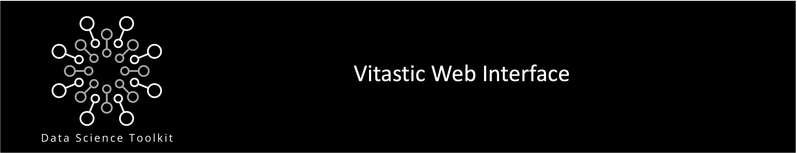
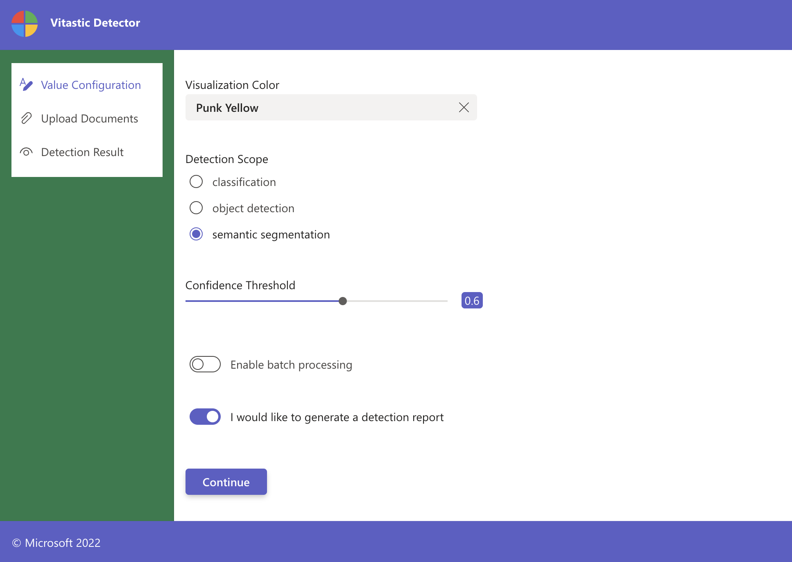
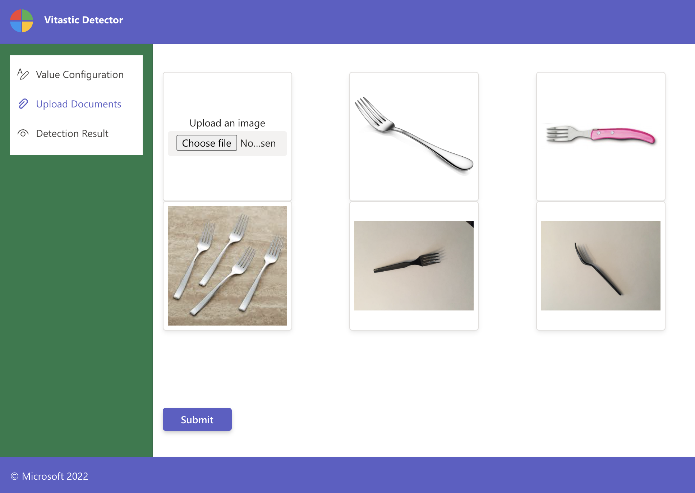
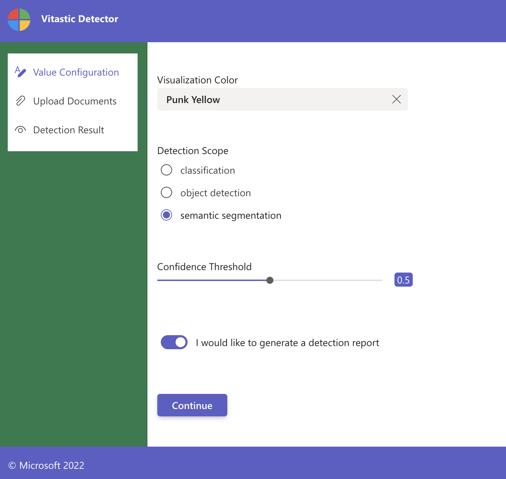
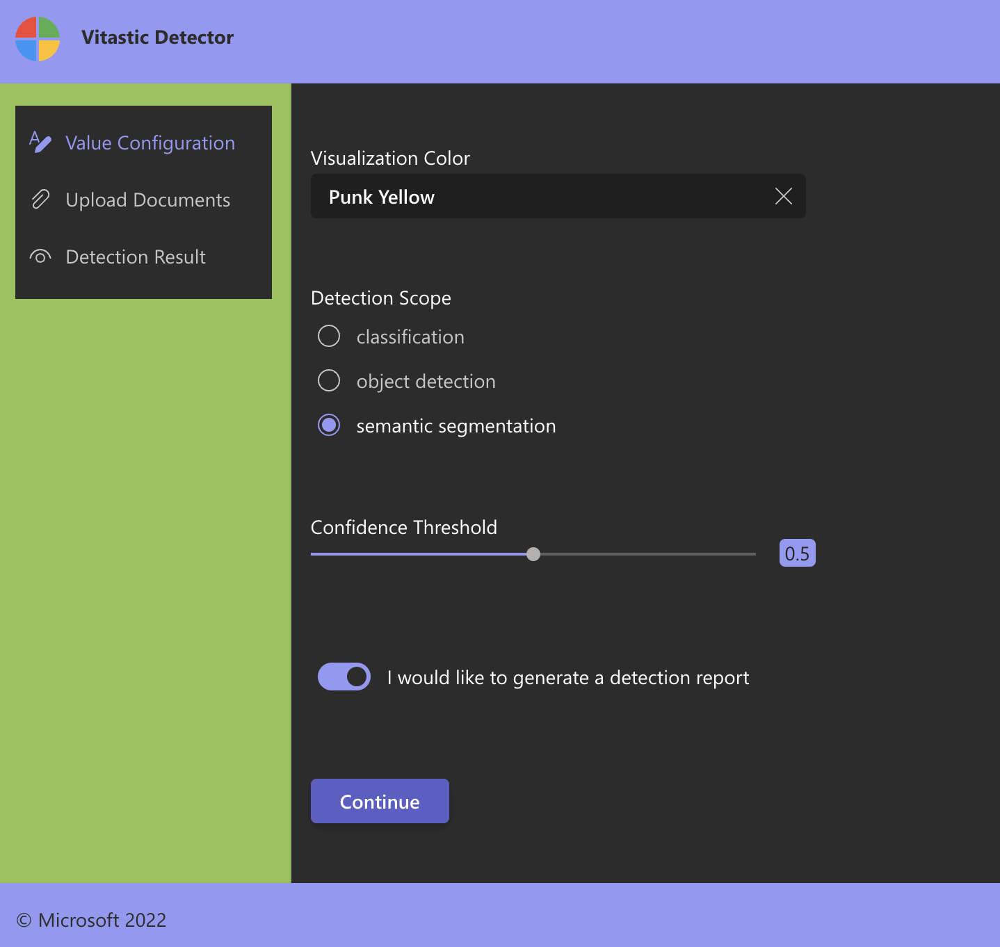
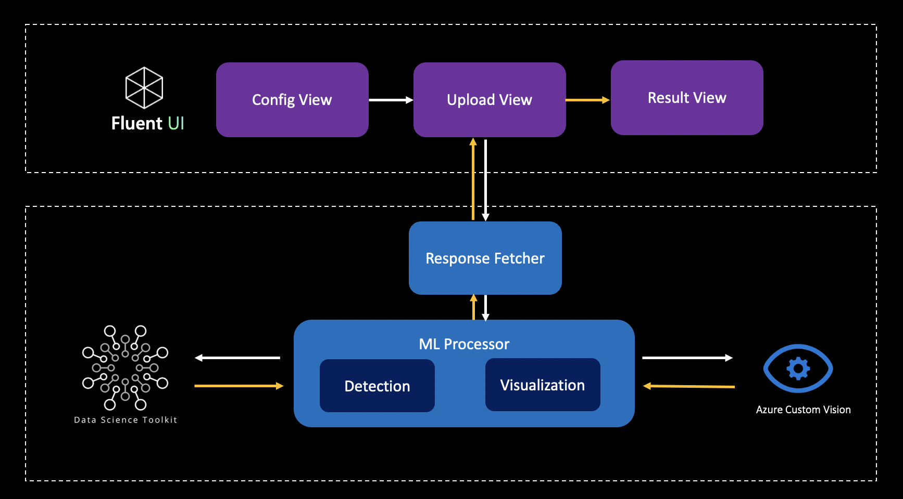

# Vitastic

Vitastic is a Javascript x Python based solution to quickly build web interface that serves object detection
workloads. By leveraging Microsoft's themable React component library [FluentUI](https://fluentsite.z22.web.core.windows.net/0.60.1) 
powered by Python [Flask](https://flask.palletsprojects.com) backend, Vitastic allows you to build your own UI to demonstrate
pre-trained image `classification`, `object detection`, or `semantic segmentation` models.

<table><tr>
<td>  </td>
<td>  </td>
</tr></table>

## Prerequisites
In order to successfully set up your solution you will need to have provisioned the following:

* `Python`: A recent `Python 3.8` interpreter to run the Flask backend on.
* `Yarn`: A package and project manager for Node.js applications.
* `Object detection model`: Deployed either in `Azure Custom Vision` or `Azure ML` as a RESTful API.
See [dstoolkit-objectdetection-accelerator](https://github.com/microsoft/dstoolkit-objectdetection-tensorflow-azureml) 
to see how to build an end-to-end training and deployment pipelines in Azure ML.


## Getting Started
### Backend
The back-end of Vitastic is implemented using python's [Flask](https://flask.palletsprojects.com) framework. All 
source code reside in the `Vitastic` folder. 

It is highly recommended create a virtual environment using e.g. package manager `conda` before the further package installing:
```
conda create -n Vitastic python=3.8
conda activate Vitastic
```
Now you can install all python package dependencies and get the backend running by:
```
cd Vitastic
pip install -r requirements.txt
flask run
```
You should be able to see the Flask app serving the `app.py` script under [http://localhost:5000](http://localhost:5000).

Once the backend app starts serving, the `app.py` script handles the incoming requests and forward the input images to 
detection jobs written in `detection.py`. To enable the detection, you need to specify the Azure ML `REST endpoint` and
(optionally) the `authentication key` in the dotenv file. Complete the information required in the `.env_example` file 
and rename the file to `.env`.

### Frontend
The front-end was bootstrapped with [Create React App](https://github.com/facebook/create-react-app), and all source code
can be found under the `vitastic-ui` directory. 

To start the front-end, navigate to the front-end directory, and install react dependencies by running:
```
cd vitastic-ui
yarn install
```
After installing, run the react app in development mode by:
```
yarn start
```
You can open [http://localhost:3000](http://localhost:3000) to view it in your browser.

### Frontend Customization
Vitastic also supports you to build a customized version of frontend design by enabling React component configurations.
You can navigate to `vitastic-ui/src/config.json` and modify this configuration file to suit your working scenarios:
```
cd vitastic-ui/src
nano config.json
```

Below is a detailed description of each configuration possibilities:
* `title`: A customizable title appearing in the top-left corner.
* `darkTheme`: Whether to use fluent UI dark theme, by default set to false.
* `defaultConfidence`: Model confidence value, by default set to 0.5.
* `modelService`: Model backbone service, currently supports Azure machine learning `aml` and Azure custom vision `cv`.
* `modelScope`: Backbone model functionality, currently supports classification, object detection or semantic segmentation
* `sampleImages`: List of image names to be presented as samples, all images should reside in the 
`vitastic-ui/public/img/samples` directory. It is optional, and ideally should be of `maximal 7 images` to for the sake of design.

<table><tr>
<td>  </td>
<td>  </td>
</tr></table>

## Repository Details 
A high-level structure of the Vitastic repository is as follows:
```
|-- Vitastic
|   |-- app.py
|   |-- detection.py
|   |-- requirements.txt
|   |-- src
|   |   |-- aml.py
|   |   |-- cv.py
|   |   `-- util.py
|-- docs
`-- vitastic-ui
	|-- package.json
    |-- public
    |   |-- img
    |   `-- index.html
    |-- src
    |   |-- App.css
    |   |-- App.js
    |   |-- AppConfig.json
    |   |-- components
    |   |   |-- ConfigView.js
    |   |   |-- UploadView.js
    |   |   `-- ResultView.js
    |   |-- index.css
    |   `-- index.js
    `-- yarn.lock
```

The following architecture illustrates how the code is organised into an end to end workflow:




## Contributing

This project welcomes contributions and suggestions.  Most contributions require you to agree to a
Contributor License Agreement (CLA) declaring that you have the right to, and actually do, grant us
the rights to use your contribution. For details, visit https://cla.opensource.microsoft.com.

When you submit a pull request, a CLA bot will automatically determine whether you need to provide
a CLA and decorate the PR appropriately (e.g., status check, comment). Simply follow the instructions
provided by the bot. You will only need to do this once across all repos using our CLA.

This project has adopted the [Microsoft Open Source Code of Conduct](https://opensource.microsoft.com/codeofconduct/).
For more information see the [Code of Conduct FAQ](https://opensource.microsoft.com/codeofconduct/faq/) or
contact [opencode@microsoft.com](mailto:opencode@microsoft.com) with any additional questions or comments.

## Trademarks

This project may contain trademarks or logos for projects, products, or services. Authorized use of Microsoft 
trademarks or logos is subject to and must follow 
[Microsoft's Trademark & Brand Guidelines](https://www.microsoft.com/en-us/legal/intellectualproperty/trademarks/usage/general).
Use of Microsoft trademarks or logos in modified versions of this project must not cause confusion or imply Microsoft sponsorship.
Any use of third-party trademarks or logos are subject to those third-party's policies.
